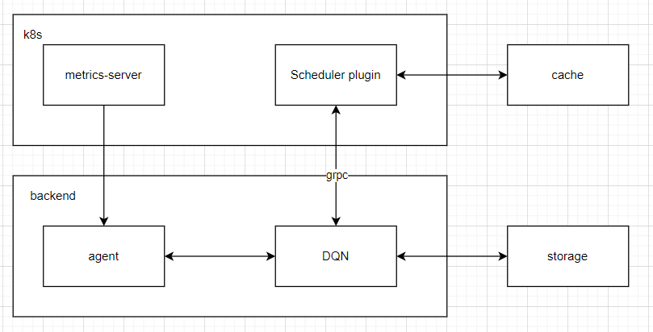
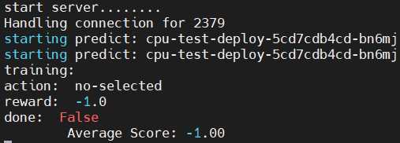

# mokubeRL

`mokubeRL` 这是一个利用强化学习(DQN)来优化`Kubernetes`中pod的插件

## Overview



## TODO
### v0.0.1

- [x] 测试
- [x] 容器化


### v0.0.2

- [x] 多状态
- [x] 支持新增/删减node
    - invalid node, 选择可用的node
    - node list append
- [x] 参数化，可配置化
- [ ] 细化奖惩
  - [ ] 将利用率放进惩罚项
- [ ] 运行脚本跑测试，检查会不会出现不往新节点分的情况，以及 epsilon 值的调节


## Usage
> `mertics-server` and `etcd` are required

### RBAC

```sh
kubectl apply -f rbac.yaml
```

### ConfigMap
```sh
kubectl create configmap rl-server-config --from-file=config.ini -n kube-system
```

### Schedule-extender
```sh
kubectl apply -f schedule-extender.yaml
```

### RL-Server
```sh
kubectl apply -f rl-server-deployment.yaml
```


## 效果
